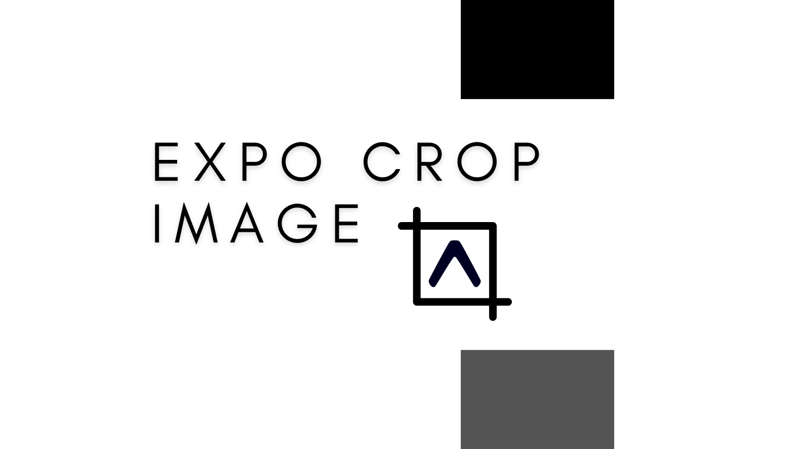
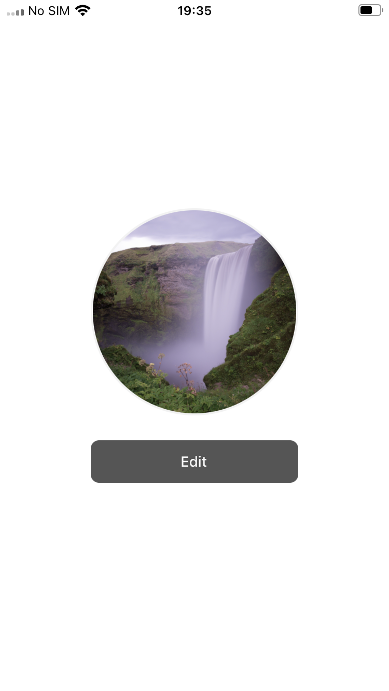
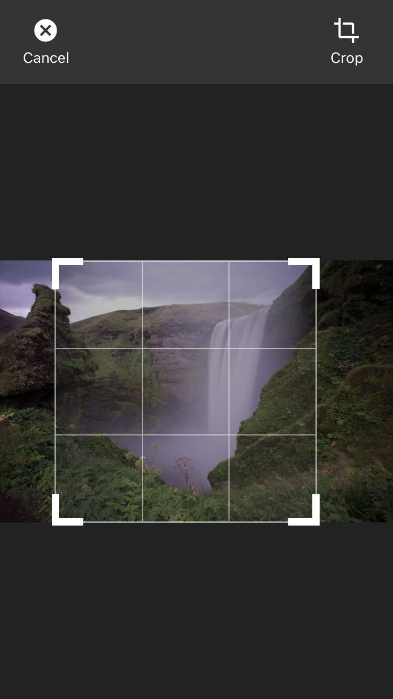

<p align="center">
  
</p>

<div align="center">
  
  
  
</div>

<h1 align="center">
  Expo crop image
</h1>

<p align="center">
Allows user to crop image with given aspect ratio for react native using expo on Android and IOS.
</p>

<br>

<p align="center">
&nbsp;&nbsp;&nbsp;&nbsp;&nbsp;&nbsp;&nbsp;&nbsp;&nbsp;&nbsp;&nbsp;&nbsp;
&nbsp;&nbsp;&nbsp;&nbsp;&nbsp;&nbsp;&nbsp;&nbsp;&nbsp;&nbsp;&nbsp;&nbsp;
&nbsp;&nbsp;&nbsp;&nbsp;&nbsp;&nbsp;&nbsp;&nbsp;&nbsp;&nbsp;&nbsp;&nbsp;
</p>

## 🚀 How to install

```bash
npm install expo-crop-image
```

## ImageEditor

isRequired if there is a \* in the name field

| name                      | Proptypes | Description                                                       |
| ------------------------- | --------- | ----------------------------------------------------------------- |
| **imageUri** \*           | string    | Image address that will be used for cropping                      |
| **fixedAspectRatio** \*   | number    | Expect => aspect ratio.                                           |
| **minimumCropDimensions** | (size)    | Expect => {width: number, height: number} [Default 100 X 100].    |
| **onEditingCancel** \*    | func      | void                                                              |
| **onEditingComplete** \*  | func      | Returns image object (image object fields => uri, width, height). |
| **editorOptions**         | object    | Customize appearance of editor                                    |
| **processingComponent**   | ReactNode | Customize appearance of loading between process                   |

## Example

```jsx
import { ImageEditor } from "expo-crop-image";

<ImageEditor
  imageUri={uri}
  fixedAspectRatio={2 / 3}
  minimumCropDimensions={{
    width: 50,
    height: 50,
  }}
  onEditingCancel={() => {
    console.log("onEditingCancel");
  }}
  onEditingComplete={(image) => {
    console.log(image);
  }}
/>;
```

## Editor Options

```jsx
import { ImageEditor } from "expo-crop-image";

<ImageEditor
  ...
  editorOptions={{
    ...
  }}
/>;

type EditorOptions = {
  backgroundColor?: string
  controlBar?: {
    position?: 'top' | 'bottom'
    backgroundColor?: string
    height?: number
    cancelButton?: IconProps
    cropButton?: IconProps
    backButton?: IconProps
    saveButton?: IconProps
  }
  coverMarker?: {
    show?: boolean
    color?: string
  }
  gridOverlayColor?: string
  overlayCropColor?: string
}

type IconProps = {
  color: string
  text: string
  iconName: FeatherIconNames | MaterialIconNames
}

```

## 🧪 Technologies

This project was developed using the following technologies:

- [ReactNative](https://reactjs.org/)
- [Expo](https://tailwindcss.com/)
- [Recoil](https://figma.com)
- [Typescript](https://storybook.js.org/)

## 📌 Requirements

To use this package you have to install the following dependencies

- [@expo/vector-icons](https://docs.expo.dev/guides/icons/)
- [expo-image-manipulator](https://docs.expo.dev/versions/latest/sdk/imagemanipulator/)
- [react-native-gesture-handler](https://docs.expo.dev/versions/latest/sdk/gesture-handler/)

## 🚀 How to run locally

Clone the project and access the folder.

```bash
git clone https://github.com/NitoBa/expo-crop-image.git

cd expo-crop-image && npm install
cd example-app && npm install && cd ..
```

Compile the package locally

```bash
# build the package locally
npm run build:dev
# watch to changes while running with app
npm run build:watch
```

## 📝 License

## This project is licensed under the MIT License. See the [LICENSE](LICENSE) file for details.

Made with 💜 by [Bruno Alves](https://nito-dev.vercel.app/) 👋
